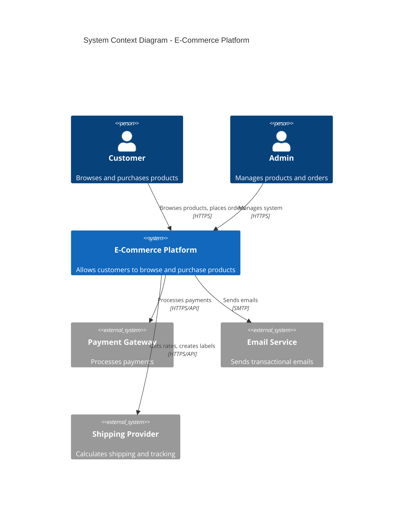
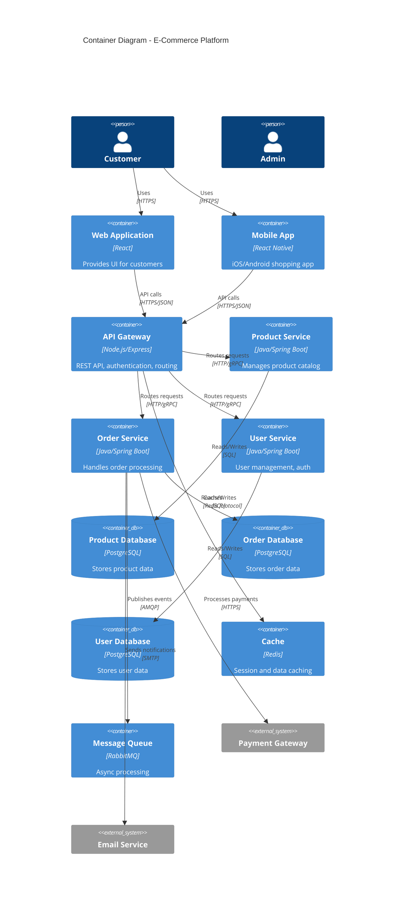

# Prompt Template: C4 Diagram Generation

## Master Prompt

```
You are an expert technical illustrator specializing in C4 architecture diagrams.
Create comprehensive C4 diagrams in Mermaid format based on the provided architecture.

# Context

Project: [PROJECT_NAME]
Architecture Type: [e.g., Microservices, Monolith, Serverless]

# Architecture Documentation

[PASTE ARCHITECTURE DOCUMENT OR DESCRIPTION]

# Task

Generate C4 diagrams in Mermaid format for all levels:

## Level 1: System Context Diagram

Show:
- The system as a box
- Users (personas) as actors
- External systems
- Relationships and data flows

## Level 2: Container Diagram

Show:
- Major containers (applications, databases, file systems)
- Technology stack for each container
- Communication protocols
- Data flows between containers

## Level 3: Component Diagram

For [SPECIFIC_CONTAINER - e.g., API Backend]:

Show:
- Internal components
- Responsibilities
- Dependencies
- Interfaces

## Level 4: Code Diagram (Optional)

For [SPECIFIC_COMPONENT]:

Show:
- Key classes/modules
- Relationships
- Design patterns used

# Output Requirements

1. Use Mermaid C4 diagram syntax
2. Include clear labels
3. Show technology stack in descriptions
4. Use consistent styling
5. Add legends where helpful
6. Ensure diagrams render correctly

# Output Format

Provide each diagram in a separate code block:

## System Context Diagram
```mermaid
[DIAGRAM CODE]
```

## Container Diagram
```mermaid
[DIAGRAM CODE]
```

[etc.]

Include brief explanations for each diagram.
```

---

## Quick Start Template

```
Create C4 diagrams in Mermaid format for:

**System:** [NAME]
**Architecture:** [DESCRIPTION]

**Components:**
- [Component 1]: [Description]
- [Component 2]: [Description]
- [...]

**External Systems:**
- [System 1]: [Purpose]
- [System 2]: [Purpose]

Please generate:
1. System Context Diagram
2. Container Diagram
3. Component Diagram for [main container]

Format: Mermaid code blocks ready to render.
```

---

## Example Output

### System Context Diagram



### Container Diagram



---

## Tips for Best Results

1. **Provide Complete Architecture:** More detail = better diagrams
2. **Specify Technology Stack:** Include frameworks, databases, protocols
3. **Iterate:** Start simple, add detail in follow-ups
4. **Test Rendering:** Paste Mermaid code into renderer to verify
5. **Request Alternatives:** Ask for different perspectives if needed

---

## Common Follow-up Prompts

```
"Can you create a sequence diagram showing the checkout flow?"

"Please add more detail to the API Gateway container"

"Can you create a deployment diagram showing AWS infrastructure?"

"Please generate an ERD for the product database"

"Can you show the authentication flow as a sequence diagram?"
```

---

## Mermaid Resources

- **Live Editor:** https://mermaid.live
- **Documentation:** https://mermaid.js.org
- **C4 Plugin:** https://github.com/plantuml-stdlib/C4-PlantUML

---

## Version

- **Template Version:** 1.0
- **Last Updated:** 2024-11-18
- **Compatible With:** Claude Sonnet 4.5
